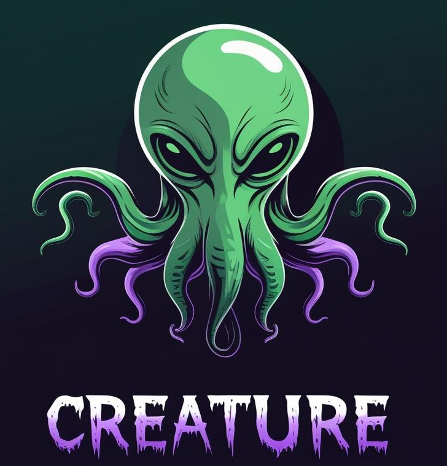
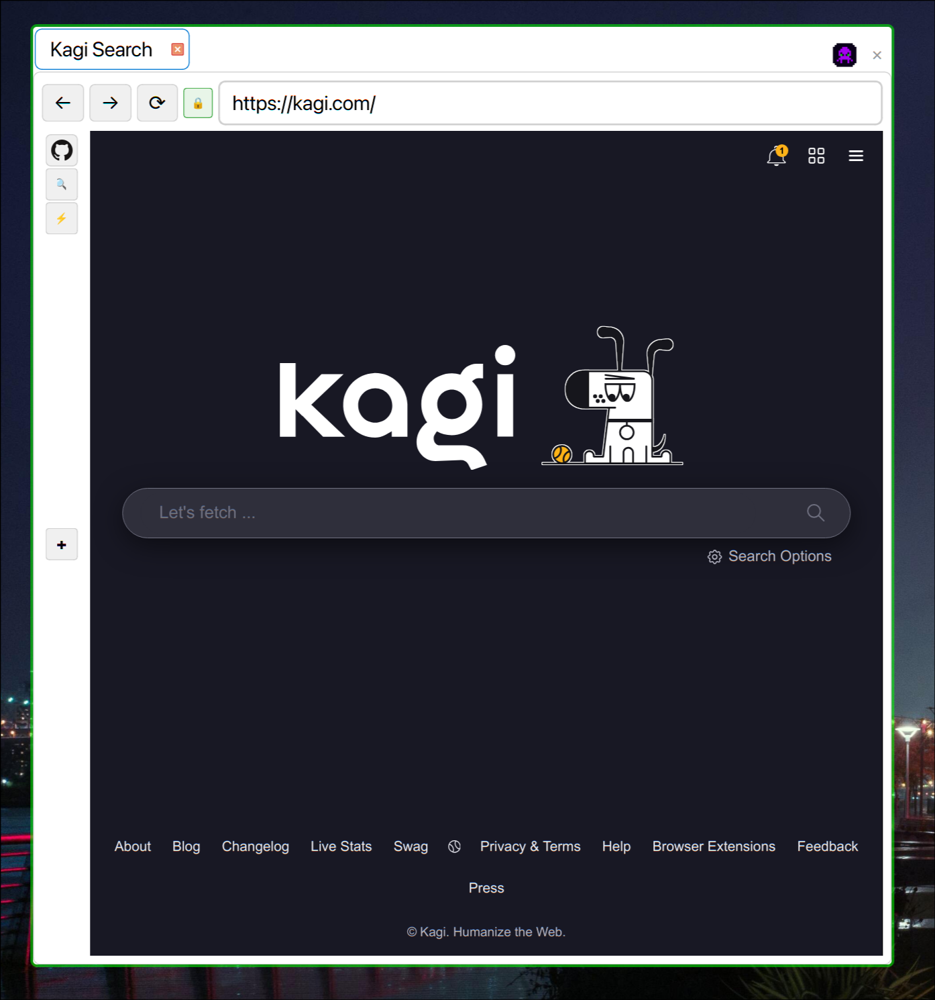
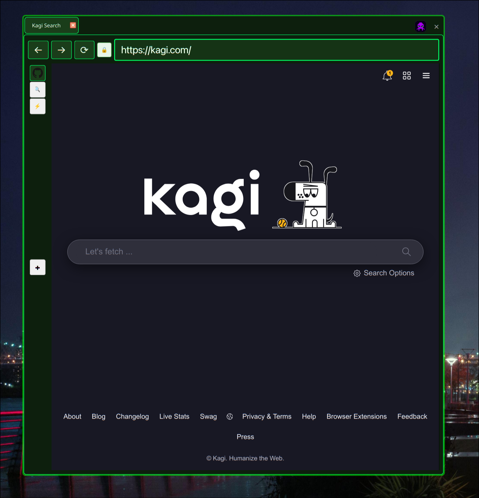
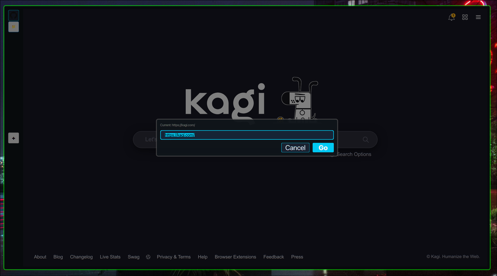

# Creature Browser

My primary gripes that I wanted to address were:
- Manage seperate profiles concurrently kind of like in [Zen Browser](https://zen-browser.app/) - but keep them in seperate windows so I don't get confused.
- Keep it simple, less features can be more. I really like the idea of [Surf](https://surf.suckless.org/) but it's TOO simple for me. I wanted a no-tabs, single window mode with more real estate dedicated to the web page, and less to feature-cruft, hence `--minimal` in the CLI options.
- I do tend to visit just a couple of sites 80% of the time. I never really used a complex bookmark library, but it's a nice feature that if they're easily accessible, I'd use them a lot. I did like Zen Browser's 'Essentials' feature, so I kind of borrowed that, in combination with a bookmark-bar kind of thing. It's pretty ugly so far, but the thought is nice, and it basically works, and since it uses Firefox's JSON format for storing bookmarks, you can go back and forth if that helps you. (it did me)

There's a lot of cleanup to do, and I ended up adding a lot of things that I hadn't planned on, but it kind of works right now, and it was oddly performant, starting up quicker than Zen or Vivaldi in my non-scientific tests. Maybe someone else can use it as a start. 

Here's some screenshots:

**Light Theme**



**Dark Theme**



**Minimal Mode**




## Features

- **Profile Isolation** - Complete separation of cookies, storage, and cache between profiles. I wanted to have seperate work/personal profiles that could be initiated from the command line
- **Custom Themes** - 8 built-in themes with support for custom theme creation
- **Per-Profile Configuration** - Different themes, home pages, and settings for each profile
- **Profile Selection Dialog** - Smart profile picker when opening URLs without specifying a particular profile. This supports using this as default browser and still allow use of profiles. 
- **Bookmark Toolbar** - Per-profile bookmark sidebar with favicon support and hierarchical organization, compatible with Firefox JSON formatted bookmarks. 
- **Minimal Mode** - Distraction-free browsing with no tabs, menu, or navigation bar (--minimal flag)
- **KeePassXC Integration** - Secure password manager integration with context menu support via keepassxc-cli
- **Wayland Support** - Targeted for use in Hyprland, so wayland support is key. 
- **ConfigObj Integration** - Flexible configuration with validation


## Project Structure

Creature Browser follows Python packaging best practices with a clean, organized structure:

```
creature/
├── creature/              # Main Python package
│   ├── browser/          # Core browser functionality
│   ├── ui/               # User interface components
│   ├── config/           # Configuration management
│   ├── security/         # Security features (SSL, KeePassXC)
│   └── utils/            # Utility functions
├── data/                 # Resource files
│   ├── config/          # Default configuration and themes
│   ├── icons/           # Application icons
│   ├── images/          # Screenshots and graphics
│   └── scripts/         # JavaScript and other scripts
├── scripts/             # Executable scripts
├── tests/               # Test suite
└── packaging/           # Platform-specific packaging files
```

This structure supports multiple deployment methods including system packages, AppImage, and Flatpak.

# Documentation
- [Installation, quickstart](docs/quickstart.md)
- [Command Line Usage](docs/command-line-usage.md)  
- [Configuration Files](docs/configuration.md)
- [Keyboard-shortcuts](docs/keyboard-shortcuts.md)
- [UI scaling](docs/ui-scaling.md)
- [KeepassXC Integration](docs/keepassxc-integration.md)
- [Hyprland Notes](docs/hyprland-configuration.md)
- [Themes](docs/themes.md)

## Advanced Usage

### Running the Application

The application can be run in several ways:

```bash
# Using uv (recommended during development)
uv run python -m creature

# Using the executable script
./scripts/creature

# After installation as a package
creature
```

Command line options:
```bash
# Launch with specific profile
creature --profile work

# Launch in minimal mode
creature --minimal

# Open specific URL
creature https://github.com

# Use custom theme
creature --theme dark
```

### System Installation

For system-wide installation, you can:

1. **Install as a Python package** (recommended):
   ```bash
   # Install in development mode
   uv pip install -e .
   
   # Or install from the repository
   pip install git+https://github.com/yourusername/creature.git
   ```

2. **Copy the executable script**:
   ```bash
   # Copy launcher script to system bin directory
   sudo cp scripts/creature /usr/local/bin/creature
   sudo chmod +x /usr/local/bin/creature
   ```

### Setting as Default Browser

1. Create a desktop entry file:
   ```bash
   cat > ~/.local/share/applications/creature.desktop << EOF
   [Desktop Entry]
   Name=Creature Browser
   Exec=creature %u
   Type=Application
   Categories=Network;WebBrowser;
   MimeType=text/html;x-scheme-handler/http;x-scheme-handler/https;
   Icon=creature
   EOF
   ```

2. Set as default:
   ```bash
   xdg-settings set default-web-browser creature.desktop
   ```

### Multiple Profiles Workflow

```bash
# Launch different profiles in separate windows
creature --profile work &
creature --profile personal &
creature --profile banking &
```

### Minimal Mode

For distraction-free browsing, use minimal mode:

```bash
# Clean interface with only bookmark sidebar and web content
creature --minimal

# Minimal mode with specific URL and theme
creature --minimal --theme dark https://example.com
```

**Minimal Mode Features:**
- No tab bar, menu, or navigation bar
- Vertical bookmark toolbar on the left
- Ctrl+G opens modal URL bar for navigation
- Ctrl+X exits the browser
- Perfect for focused reading or kiosk-style usage

### Bookmark Management

Bookmarks are stored per-profile with automatic favicon fetching:

- **Add bookmarks**: Click the "+" button in the bookmark toolbar
- **Edit bookmarks**: Right-click bookmark → Edit
- **Delete bookmarks**: Right-click bookmark → Delete
- **Hierarchical organization**: Support for bookmark folders
- **Favicon caching**: Automatic website icon fetching and caching

Bookmarks are stored in `~/.config/creature/profiles/<profile>/bookmarks.json`

## Development

### Adding New Features

1. Configuration options go in `config.spec`
2. Themes go in `themes/` directory
3. Follow existing code patterns for consistency

## Contributing

Contributions are welcome! Please:
1. Fork the repository
2. Create a feature branch
3. Make your changes
4. Submit a pull request

## License

MIT License 

## Acknowledgments

- Built with PyQt6 and Qt WebEngine
- Configuration management via ConfigObj
- Lots of Claude Code work
